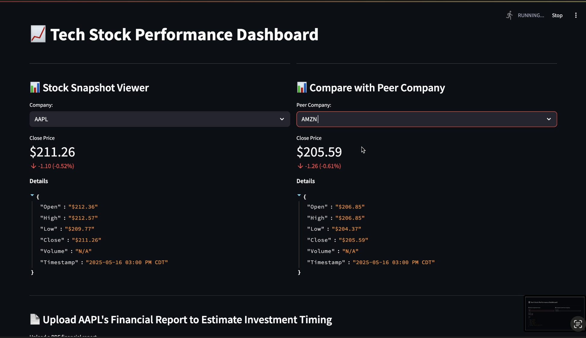
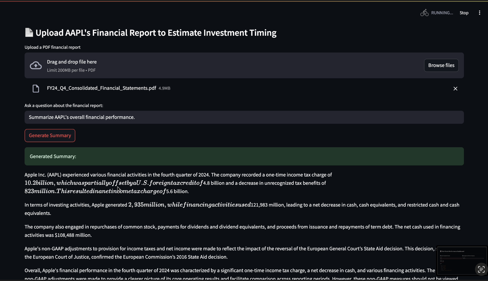
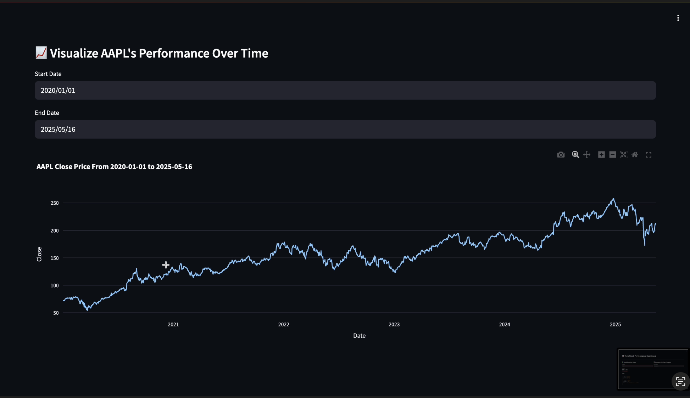

# TradeView

TradeView is an interactive financial dashboard designed to give a clear and actionable snapshot of twelve of the world's leading tech companies:

["AAPL", "MSFT", "GOOGL", "AMZN", "META", "NVDA", "TSLA", "AMD", "CRM", "ADBE", "INTC", "ORCL"]

Built with Streamlit, this dashboard combines real-time financial data, historical analysis, and a powerful LLM-based financial report summarizer.

### Key Features

📈 Real-Time Stock Insights

- Fetches live statistics from the Finnhub API

- Displays current price, percent change, high/low values, previous close, and more

📉 Historical Performance Visualization

- Interactive line charts using data from Yahoo Finance

- Users can customize the time range to analyze price trends

🧠 RAG-Powered LLM Financial Summarizer

- Upload company financial reports (PDFs) like earnings calls or investor decks

- A Retrieval-Augmented Generation (RAG) pipeline powered by HuggingFace and Haystack reads and summarizes key insights

- Results are clear, concise, and can easily be understood without a finance degree!
  

### RAG-Powered LLM Summarizer:

Upload a financial report PDF (e.g., earnings reports, investor statements).

The built-in Retrieval-Augmented Generation (RAG) pipeline will summarize key financial information in a concise, accessible format.

Summaries highlight key metrics/performance trends.

### How to Use the Financial Report Summarizer

Upload a PDF financial report related to the selected company.

The RAG LLM will process the text and return a clear, human-readable summary within seconds.

Use the summary to gain a quick understanding of the company’s financial health, performance highlights, and forward-looking insights.

### Dashboard Preview

